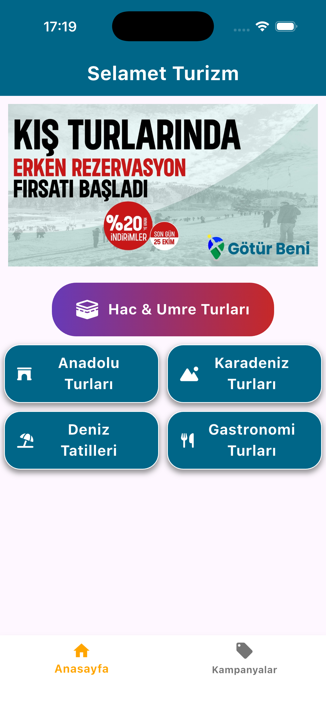
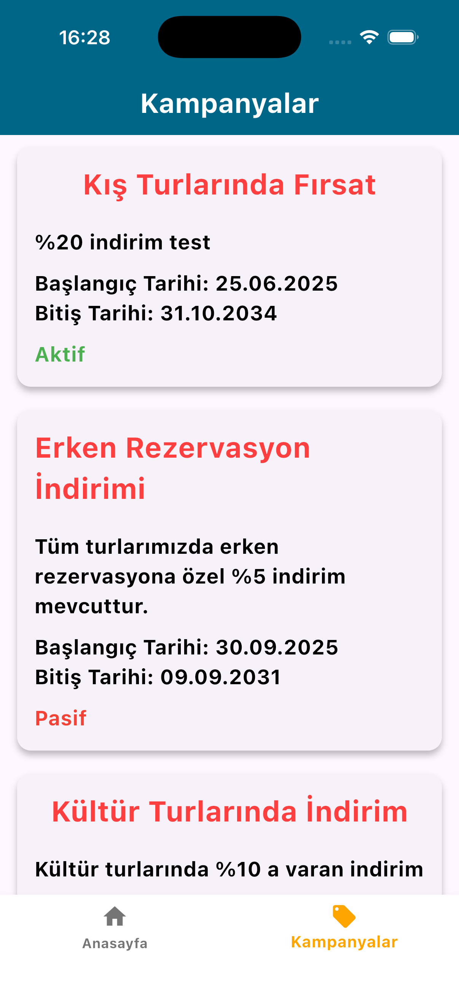
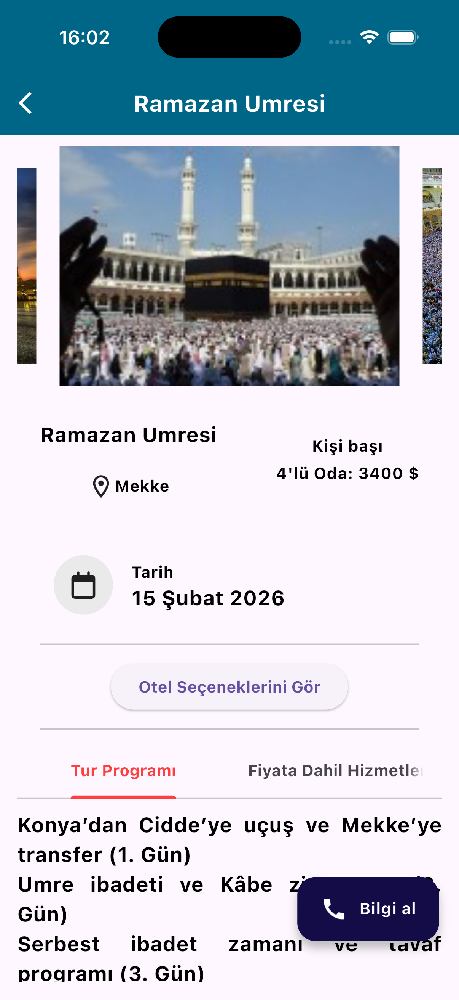
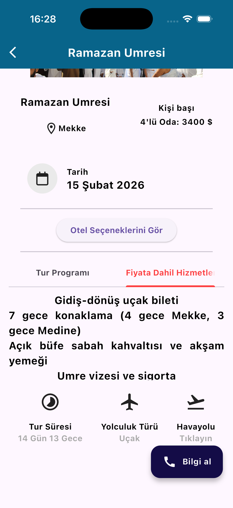
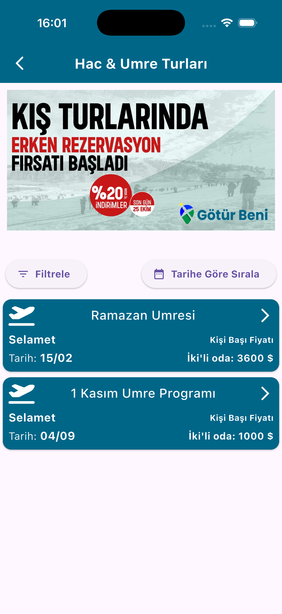

# Turizm Dijitalleşme – Kullanıcı Uygulaması


[](LICENSE)

Turizm Dijitalleşme Projesi, bir turizm acentesinin işlerini hem kullanıcı hem de yönetici tarafında dijitalleştirmek amacıyla geliştirilmiş iki entegre uygulamadan oluşmaktadır.

* **Kullanıcı Uygulaması** → Paket turları listeleme, detaylarını inceleme, kampanya ve reklamları görüntüleme.
* **Admin Uygulaması** → Turlar, kampanyalar, rezervasyonlar, müşteri bilgileri ve finans süreçlerinin yönetilmesi.

---

## 🌟 Özellikler

### Kullanıcı Uygulaması

* 🏖️ **Tur Paketleri**: Turları kategorilere göre listeleme ve detaylarını görüntüleme
* 🏨 **Tur Detayları**: Otel seçenekleri, açıklamalar, fotoğraf galerisi (carousel)
* 📢 **Kampanyalar ve Reklamlar**: Acentenin güncel kampanyalarını ve reklamlarını takip etme
* ⭐ **Değerlendirme**: Kullanıcıların turları puanlaması
* 🔗 **Hızlı Erişim**: Link açma (URL Launcher)

---

## 🚧 Planlanan Özellikler

* Gerçek zamanlı bildirimler (Firebase Cloud Messaging)
* Çoklu dil desteği
* Kullanıcı rezervasyon yönetimi

---

## 🧰 Teknik Altyapı

* **Framework**: Flutter (Cross-platform)
* **Dil**: Dart
* **Backend & Database**: Firebase (Authentication, Firestore, Storage)
* **Mimari**: MVVM + BLoC (State Management)
* **Durum Yönetimi**: flutter_bloc, equatable

---

## 📸 Ekran Görüntüleri

<table>
  <tr>
    <td></td>
    <td></td>
    <td></td>
    <td></td>
    <td></td>
    <td></td>
  </tr>
</table>

---

## 📂 Proje Yapısı (Örnek)

```plaintext
lib/
├── core/
│   └── theme/
│       ├── constant.dart
│       └── light_theme_data.dart
├── Feature/
│   ├── Campaign/         # Kampanya modülü
│   ├── Tours/            # Tur listeleme & filtreleme
│   ├── Tur_Detaylari/    # Tur detay sayfası
│   ├── HomePage/         # Ana sayfa & bottom navbar
│   └── Reklam/           # Reklam modülü
├── firebase_options.dart # Firebase config
└── main.dart             # Giriş noktası
```

---

## 🚀 Kurulum ve Çalıştırma

### Gereksinimler

* Flutter SDK (3.4 veya üstü)
* Dart SDK (>=3.4.0 <4.0.0)
* Firebase hesabı ve gerekli konfigürasyon dosyaları (`google-services.json` / `GoogleService-Info.plist`)

### Çalıştırma Adımları

1. **Depoyu klonlayın**

   ```bash
   git clone https://github.com/wetadeveloper/turizm_acente_user.git
   cd turizm_acente_user
   ```

2. **Bağımlılıkları yükleyin**

   ```bash
   flutter pub get
   ```

3. **Firebase konfigürasyonunu ekleyin**

   * Android → `android/app/google-services.json`
   * iOS → `ios/Runner/GoogleService-Info.plist`

4. **Uygulamayı çalıştırın**

   ```bash
   flutter run
   ```

---

## 📊 Yol Haritası

| Özellik                  | Durum        |
| ------------------------ | ------------ |
| Tur listeleme & detaylar | ✅ Tamamlandı |
| Kampanyalar              | ✅ Tamamlandı |
| Reklam modülü            | ✅ Tamamlandı |
| Kullanıcı girişi         | ✅ Tamamlandı |
| Bildirim sistemi         | ⏳ Planlandı  |
| Çoklu dil desteği        | ⏳ Planlandı  |

---

## 📄 Lisans

Bu proje MIT lisansı ile dağıtılmaktadır. Daha fazla bilgi için `LICENSE` dosyasına göz atın.

---

## 📬 İletişim

**Furkan Pala** – Flutter Developer
[](https://www.linkedin.com/in/furkan-pala-9086191b0/)
[](https://github.com/wetadeveloper)

